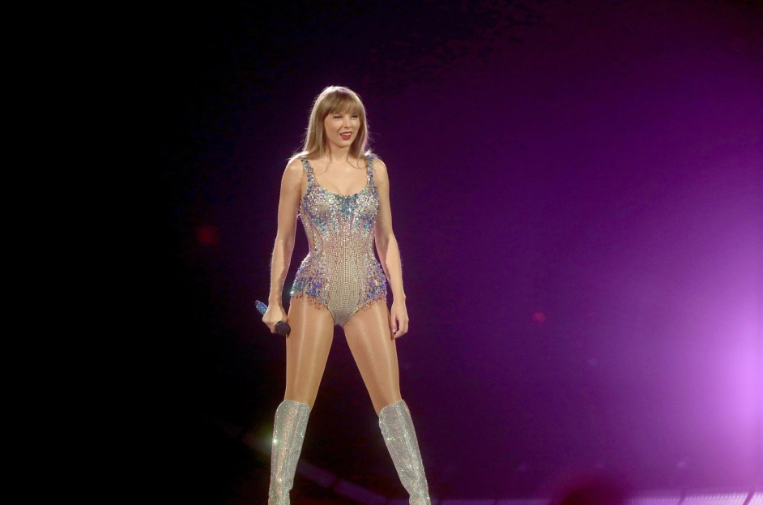

# **Zhu's User Page**
## ***Self-introduction as a programmar***
### My Like/Unlike terminal commands
My favorite terminal command is `cd [directory]`, which helps me change from the current working directory to the certain directory. However, I do not like `rm [file]` as it would remove the specified file.

### My CS Enlightment Mentor
My favorite high school instructor who has inspired me to become a programmar and devote into computer science subject is Mr.Ansari [Mansoor Ansari] (https://revonect.com/contact/Mansoor%20Ansari/id/931294736405).

### The programming languages that I have learnt so far:
- JAVA
* HTML/CSS/JavaScript/MySQL
+ C#/C++
### The programming languages that I want to learn in the future:
1. Python
2. Ruby
3. Swift

## ***Self-introduction as a person***
### My personal favorite quoting is that : 
> "Believe in yourself and all that you are. Know that there is something inside you that is greater than any obstacle." - Christian D. Larson.

### [My favorite dog picture](https://www.freepik.com/premium-photo/siberian-husky-dog-cute-wolf-winter-forest-snow-closeup_23031297.htm) 
My favorite dog is husky and have a brown, very adorable husky in Beijing. He is almost 9 years old. I hope he could always stay healthy and happy.

### My favorite singers

[Screenshot of Charlie Puth.](./Charlie.jpeg)

### My life goals
- [x] Learned how to ski and skuba diving
- [ ] Succesfully complete my Bachelor and Master degrees
- [ ] Create a company of my own and make money!

